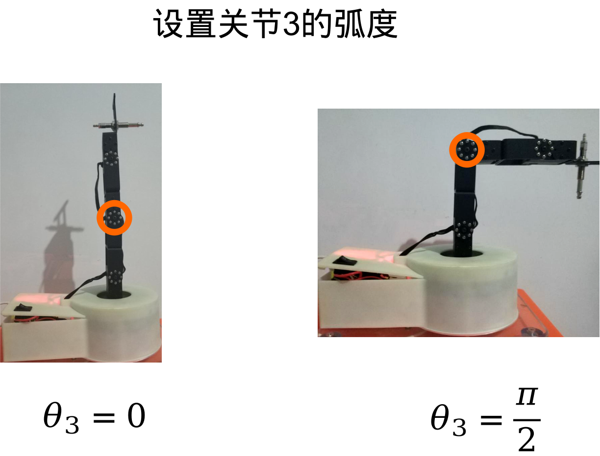

# FashionStar四自由度机械臂使用手册


[toc]

作者: 阿凯|Kyle

邮箱: xingshunkai@qq.com

更新时间: 2020 / 04 / 23


## 安装机械臂的Arduino库

将`FashionStar_Arm4DoF`这个工程文件, 整体拷贝到`Arduino IDE` 安装路径下的`libraries` 这个文件夹.


## Arduino Uno固件烧录的操作流程

1. 将Arduino UNO与PC相连

2. 断开Arduino UNO拓展版的外接电源的开关.

   开关拨至`OFF`

   

   

3. 在PC端打开Arduino IDE, 打开机械臂的例程文件.

   `Arduino IDE > Examples > FashionStar_ARM4DoF`

4. 编译并烧录固件至Arduino UNO

5. 打开Arduino UNO拓展板的外接电源的开关

   开关拨至`ON`

6. 按下Arduino UNO拓展版上的`RESET`按键. 

   **注: 一定要记得按下RESET键**


## 软串口日志输出

### 简介

因为Arduino Uno的硬件串口`Hardware Serial`会被串口舵机占用, 所以我们需要使用`Soft Serial` 来做日志输出.

### 操作流程

1. 安装USB转TTL模块的驱动程序.

2. 将Arduino跟USB转TTL模块通过杜邦线相连

   | Arduino UNO             | USB转TTL模块                |
   | ----------------------- | --------------------------- |
   | pin 6 (软串口RX 接收端) | Tx (USB转TTL模块的接收端)   |
   | pin7 (软串口Tx 发送端)  | Rx （USB转TTL模块的发送端） |
   | GND                     | GND                         |

   *实物图*

   

3. 将USB转TTL模块插入到电脑的USB口上

4. 打开串口调试助手, 选择USB转TTL模块的端口号, 配置如下

   

   点击`Open` ,  打开端口.

5. 打开`Arduino IDE > Examples > FashionStar_ARM4DoF >  software_serial` 

   将例程烧录到Arduino UNO 里面.

6. 查看运行效果 

   

### 例程源码

`software_serial.ino`

```cpp
/*
 * 测试软串口
 * 
 * <接线方式>
 * - Arduino Pin 6(软串口RX)  -> USB转TTL TX
 * - Arduino Pin 7(软串口TX)  -> USB转TTL RX
 * - Arduino GND              -> USB转TTL GND
 */
#include <SoftwareSerial.h>

// 软串口的配置
#define SOFT_SERIAL_RX 6
#define SOFT_SERIAL_TX 7
#define SOFT_SERIAL_BAUDRATE 4800
// 创建软串口
SoftwareSerial softSerial(SOFT_SERIAL_RX, SOFT_SERIAL_TX);

void setup(){
    
    softSerial.begin(SOFT_SERIAL_BAUDRATE); // 初始化软串口的波特率
}

void loop(){
    //发送一个数据
    softSerial.print("Hello World\n");
    delay(1000);
}
```


## 阻尼模式

### 简介

设置舵机为阻尼模式, 并不断的查询舵机的原始角度。用手掰舵机, 查看舵机原始角度的变化.


### 例程源码-阻尼模式与舵机原始角度回读

`arm_damping_mode.ino`

```cpp
/* 
 * 机械臂阻尼模式与原始角度回读 
 * --------------------------
 * 作者: 阿凯|Kyle
 * 邮箱: xingshunkai@qq.com
 * 更新时间: 2020/05/14
 */
#include <SoftwareSerial.h>
#include "FashionStar_Arm4DoF.h"

// 软串口的配置
#define SOFT_SERIAL_RX 6
#define SOFT_SERIAL_TX 7
#define SOFT_SERIAL_BAUDRATE 4800

SoftwareSerial softSerial(SOFT_SERIAL_RX, SOFT_SERIAL_TX); // 创建软串口
FSARM_ARM4DoF arm; //机械臂对象

void setup(){
    softSerial.begin(SOFT_SERIAL_BAUDRATE); // 初始化软串口的波特率
    arm.init(); //机械臂初始化
    arm.setDamping(); //设置舵机为阻尼模式
}

void loop(){
    FSARM_JOINTS_STATE_T thetas;
    arm.queryRawAngle(&thetas); //更新舵机角度
    //打印机械臂当前的舵机角度(原始)
    String message = "Servo Raw Angles: [ "+ String(thetas.theta1, 2)+\
         ", " + String(thetas.theta2, 2) + \
         ", " + String(thetas.theta3, 2) + \
         ", " + String(thetas.theta4, 2) + " ]";
    softSerial.println(message);  

    // 查询关节角度
    arm.queryAngle(&thetas);
    message = "Joint Real Angles: [ " +   String(thetas.theta1, 2)+\
         ", " + String(thetas.theta2, 2) + \
         ", " + String(thetas.theta3, 2) + \
         ", " + String(thetas.theta4, 2) + " ]";
    softSerial.println(message);
    delay(1000);
}
```

**日志输出**


## 机械臂标定

### 简介

通过阻尼模式例程，采集特定关节在特定角度下的原始舵机角度, 并同步修改`FashionStar_Arm4DoF.h` 里面的相关配置.

### 机械臂舵机ID分配

机械臂舵机ID分配如下: 


### 世界坐标系

机械臂的世界坐标系/机械臂基坐标系定义如下:


世界坐标系的原点定义在#1号舵机的转轴中心处, 机械臂正前方为X轴, 上方为Z轴, Y轴指向纸面朝外.

### 机械臂关节与关节坐标系定义

关节与关节坐标系定义如下图所示:





### 舵机原始角度数据采集

运行``arm_damping_mode.ino`` 例程, 在阻尼模式下，将机械臂的关节掰到指定的位置, 并读取此时舵机的原始角度, 记录下来.

将采集的数据同步修改到`FashionStar_Arm4DoF.h`里面.

```cpp
// 舵机标定参数
#define FSARM_JOINT1_P90 -92.6  //关节1为90°时的舵机原始角度
#define FSARM_JOINT1_N90 91.4   //关节1为-90°时的舵机原始角度
#define FSARM_JOINT2_P0 89.3    //关节2为0°时的舵机原始角度
#define FSARM_JOINT2_N90 -0.2   //关节2为-90°时的舵机原始角度
#define FSARM_JOINT3_P90 -48.4  //关节3为90°时的舵机原始角度
#define FSARM_JOINT3_N90 134.8  //关节3为-90°时的舵机原始角度
#define FSARM_JOINT4_P90 -90.5  //关节4为90°时的舵机原始角度
#define FSARM_JOINT4_N90 91.4   //关节4为-90°时的舵机原始角度
```


## 机械臂初始化与回归机械零点(home)

### 简介

创建机械臂对象,机械臂硬件资源初始化， 并且让机械臂回归机械零点(Home).


### API讲解

导入机械臂的库文件

```cpp
#include "FashionStar_Arm4DoF.h"
```

创建一个机械臂对象

```cpp
FSARM_ARM4DoF arm; //机械臂对象
```

机械臂初始化:

* 硬件资源初始化: 串口, 气泵, 舵机初始化.

* 载入舵机标定数据, 限定舵机角度范围

  设置舵机的平均转速.

```
arm.init(); //机械臂初始化
```

控制舵机归回到机械零点（Home）

```cpp
arm.home();
```


这个机械零点可以自定义, 如果要修改机械零点的位置需要修改`FashionStar_Arm4DoF.h`

```cpp
// HOME 
// 摄像头处于工作台中心的正上方, 
// 工作台的四个角点刚刚填满整个画面.
#define FSARM_HOME_X 12
#define FSARM_HOME_Y 0
#define FSARM_HOME_Z 10

```

### 例程源码-机械臂初始化与回归机械零点

```cpp
/*
 * 机械臂末端移动到Home的位置
 * --------------------------
 * 作者: 阿凯|Kyle
 * 邮箱: xingshunkai@qq.com
 * 更新时间: 2020/04/23
 */

#include "FashionStar_Arm4DoF.h"

FSARM_ARM4DoF arm; //机械臂对象


void setup(){
    arm.init(); //机械臂初始化
    arm.home();
    // 手动调整值
    // arm.move(12, 0, 10, true);
}

void loop(){
    
}
```


## 设定机械臂关节角度

### 简介

控制机械臂的关节角度, 等待机械臂运动到特定的位置之后, 再执行后续的动作.

### API讲解

使用`setAngle()`函数控制舵机的角度.

`FashionStar_Arm4DoF.h` 里面定义了关节状态结构体`FSARM_JOINTS_STATE_T` .

```cpp
typedef struct{
    float theta1;
    float theta2;
    float theta3;
    float theta4;
}FSARM_JOINTS_STATE_T;
```

创建一个关节状态结构体

```cpp
FSARM_JOINTS_STATE_T thetas; 
```

依次填写关节角度

```cpp
// 关节角度
thetas.theta1 = 0.0;
thetas.theta2 = -60.0;
thetas.theta3 = 105.0;
thetas.theta4 = -45.0;
```

设置舵机旋转到特定的角度

```cpp
arm.setAngle(thetas);
```

使用`wait()`函数实现阻塞式等待,  不断查询舵机角度, 直到舵机旋转到目标角度

```cpp
arm.wait();            // 等待舵机旋转到目标位置
```


### 例程源码-设置机械臂关节的角度

```cpp
/*
 * 设置机械臂关节的角度
 * --------------------------
 * 作者: 阿凯|Kyle
 * 邮箱: xingshunkai@qq.com
 * 更新时间: 2020/04/23
 */
#include "FashionStar_Arm4DoF.h"

FSARM_ARM4DoF arm; //机械臂对象

void setup(){
    arm.init(); //机械臂初始化
}

void loop(){
    FSARM_JOINTS_STATE_T thetas; // 关节角度
    thetas.theta1 = 0.0;
    thetas.theta2 = -60.0;
    thetas.theta3 = 105.0;
    thetas.theta4 = -45.0; // 注: 因为theta4会被自动算出来,有一个末端水平的约束
                           // theta4 = -(theta2 + theta3)
    arm.setAngle(thetas);  // 设置舵机旋转到特定的角度
    arm.wait();            // 等待舵机旋转到目标位置
    
    delay(1000); // 等待1s

    thetas.theta1 = 90.0;
    arm.setAngle(thetas);  // 设置舵机旋转到特定的角度
    arm.wait();            // 等待舵机旋转到目标位置
    delay(1000);
}
```


## 机械臂正向运动学

### 简介

所谓正向运动学就是在已知关节角度的前提下, 计算机械臂末端在机械臂基坐标系下的位置/位姿.

### API讲解

`FashionStar_Arm4DoF.h` 里面定义了笛卡尔空间下点坐标的结构体`FSARM_POINT3D_T`

```cpp
// 笛卡尔空间下的点
typedef struct{
    float x;
    float y;
    float z;
}FSARM_POINT3D_T;
```


机械臂正向运动学函数原型

```cpp
FSARM_STATUS forwardKinematics(FSARM_JOINTS_STATE_T thetas, FSARM_POINT3D_T* toolPosi);
```

<输入参数 >

* `thetas` 关节状态结构体
* `toolPosi` 工具在世界坐标系下的位置 

<输出参数>

无


演示样例:

```cpp
FSARM_JOINTS_STATE_T thetas; // 关节角度
FSARM_POINT3D_T toolPosi; // 末端的位置
// 设置关节角度
thetas.theta1 = 0.0;
thetas.theta2 = -60.0;
thetas.theta3 = 105.0;
thetas.theta4 = -45.0;
// 机械臂正向运动学
arm.forwardKinematics(thetas, &toolPosi);
```


### 例程源码-机械臂正向运动学

```cpp
/*
 * 测试机械臂正向运动学
 * --------------------------
 * 作者: 阿凯|Kyle
 * 邮箱: xingshunkai@qq.com
 * 更新时间: 2020/04/23
 */
#include <SoftwareSerial.h>
#include "FashionStar_Arm4DoF.h"
// 软串口的配置
#define SOFT_SERIAL_RX 6
#define SOFT_SERIAL_TX 7
#define SOFT_SERIAL_BAUDRATE 4800

SoftwareSerial softSerial(SOFT_SERIAL_RX, SOFT_SERIAL_TX); // 创建软串口
FSARM_ARM4DoF arm; //机械臂对象

void testForwardKinematics(){
    FSARM_JOINTS_STATE_T thetas; // 关节角度
    thetas.theta1 = 0.0;
    thetas.theta2 = -60.0;
    thetas.theta3 = 105.0;
    thetas.theta4 = -45.0; // 注: 因为theta4会被自动算出来,有一个末端水平的约束
                           // theta4 = -(theta2 + theta3)
    arm.setAngle(thetas);  // 设置舵机旋转到特定的角度
    arm.wait();            // 等待舵机旋转到目标位置
    
    FSARM_POINT3D_T toolPosi; // 末端的位置
    arm.forwardKinematics(thetas, &toolPosi); // 正向运动学
    // 打印正向运动学的结果
    softSerial.println("Tool Posi: X= " + String(toolPosi.x, 1) +\
         ", Y= " + String(toolPosi.y, 1) + \
         ", Z= " + String(toolPosi.z, 1));

}
void setup(){
    softSerial.begin(SOFT_SERIAL_BAUDRATE); // 初始化软串口
    arm.init(); //机械臂初始化
    arm.setDamping(); //设置舵机为阻尼模式

    softSerial.println("Test Forward Kinematics");
    testForwardKinematics();
}

void loop(){

}
```

*日志输出*


## 机械臂逆向运动学

### 简介

机械臂逆向运动学是指,给定工具在世界坐标系下的位姿, 求解此时关节的角度.


### API讲解

机械臂逆向运动学的函数原型:

```cpp
FSARM_STATUS inverseKinematics(FSARM_POINT3D_T toolPosi, FSARM_JOINTS_STATE_T* thetas);
```

**<输入参数>**

* `toolPosi`: 工具坐标
* `thetas`: 关节状态

**<输出参数>**

* `FSARM_STATUS` 状态码

  通过状态码可以知道逆向运动学求解是否成功,  如果失败则可以查看到底是哪个关节超出范围.

  状态码的定义如下:

  ```cpp
  // 状态码
  #define FSARM_STATUS uint8_t
  #define FSARM_STATUS_SUCCESS 0 // 成功
  #define FSARM_STATUS_FAIL 1 // 失败
  #define FSARM_STATUS_JOINT1_OUTRANGE 2 // 关节1超出范围
  #define FSARM_STATUS_JOINT2_OUTRANGE 3 // 关节2超出范围
  #define FSARM_STATUS_JOINT3_OUTRANGE 4 // 关节3超出范围
  #define FSARM_STATUS_JOINT4_OUTRANGE 5 // 关节4超出范围
  #define FSARM_STATUS_TOOLPOSI_TOO_FAR 6 // 工具坐标目标点距离机械臂太遥远
  ```

  

演示示例:

```cpp
FSARM_POINT3D_T toolPosi; // 末端位置
FSARM_JOINTS_STATE_T thetas; // 关节角度-逆向运动学输出的结果
// 设置末端的坐标
toolPosi.x = 10.0;
toolPosi.y = 0.0;
toolPosi.z = -3.0;
// 机械臂逆向运动学
FSARM_STATUS code = arm.inverseKinematics(toolPosi, &thetas);
```


### 例程源码-机械臂逆向运动学 

```cpp
/*
 * 测试机械臂逆向运动学
 * --------------------------
 * 作者: 阿凯|Kyle
 * 邮箱: xingshunkai@qq.com
 * 更新时间: 2020/04/23
 */

#include <SoftwareSerial.h>
#include "FashionStar_Arm4DoF.h"
// 软串口的配置
#define SOFT_SERIAL_RX 6
#define SOFT_SERIAL_TX 7
#define SOFT_SERIAL_BAUDRATE 4800
// 创建软串口
SoftwareSerial softSerial(SOFT_SERIAL_RX, SOFT_SERIAL_TX);
FSARM_ARM4DoF arm; //机械臂对象

void setup(){
    softSerial.begin(SOFT_SERIAL_BAUDRATE);
    arm.init(); //机械臂初始化

    // 测试正向运动学
    softSerial.println("Test Forward Kinematics");
    FSARM_JOINTS_STATE_T thetas; // 关节角度
    FSARM_POINT3D_T toolPosi; // 末端位置
    thetas.theta1 = 30.0;
    thetas.theta2 = -45.0;
    thetas.theta3 = 105.0;
    thetas.theta4 = -60.0; // 注: 因为theta4会被自动算出来,有一个末端水平的约束
                           // theta4 = -(theta2 + theta3)
    arm.setAngle(thetas);  // 机械臂运动到目标角度
    arm.wait();

    // 测试逆向运动学
    // 用正向运动学的结果验证逆向运动学的结果
    arm.forwardKinematics(thetas, &toolPosi); // 正向运动学
    // 打印正向运动学的结果
    softSerial.println("Tool Posi: X= " + String(toolPosi.x, 1) +\
         ", Y= " + String(toolPosi.y, 1) + \
         ", Z= " + String(toolPosi.z, 1));

    // 逆向运动学
    softSerial.println("Test Inverse Kinematics");
    FSARM_JOINTS_STATE_T thetas_ret; // 关节角度-逆向运动学输出的结果
    FSARM_STATUS code = arm.inverseKinematics(toolPosi, &thetas_ret);
    softSerial.println("code = "+String(code, DEC));
    softSerial.println("thetas = [" + String(thetas_ret.theta1, 2) + ", "\
        + String(thetas_ret.theta2, 2) + ", "\
        + String(thetas_ret.theta3, 2) + ", "\
        + String(thetas_ret.theta4, 2) + "]");
    
}

void loop(){

}
```

**输出日志**


## 机械臂末端控制(move)

### 简介

控制机械臂的末端移动到特定的位置.


### API讲解

移动末端函数`move`的函数原型:

```cpp
FSARM_STATUS move(float tx, float ty, float tz, bool isWait);
```

move函数在调用的时候, 是默认机械臂的末端始终平行于工作台, 末端的轨迹为自由轨迹

**<输入参数>**

* `tx`: 末端工具坐标 x
* `ty`: 末端工具坐标 y
* `tz`: 末端工具坐标 z
* `isWait`: 是否是阻塞式等待

**<输出参数>**

* `FSARM_STATUS`: 状态码, 与机械臂逆向运动学求解里面的定义相同.


使用示例:

```cpp
// 机械臂末端移动到 x1=10, y1=0, z1=5
// 并且阻塞式等待, 直到机械臂运动到目标角度, 才结束该语句
arm.move(10, 0, 5, true);
```

等同于

```cpp
arm.move(10, 0, 5);
arm.wait()
```


### 例程源码-机械臂末端控制

`arm_move.ino`

```cpp
/*
 * 测试机械臂点控, 从一个点运动到另外一个点
 * --------------------------
 * 作者: 阿凯|Kyle
 * 邮箱: xingshunkai@qq.com
 * 更新时间: 2020/04/23
 */
#include "FashionStar_Arm4DoF.h"

FSARM_ARM4DoF arm; //机械臂对象

void setup(){
    arm.init(); //机械臂初始化
}

void loop(){
    // 机械臂末端移动到 x1=10, y1=0, z1=5
    // 并且阻塞式等待, 直到机械臂运动到目标角度, 才结束该语句
    arm.move(10, 0, 5, true);
    delay(1000); // 停顿1s
    
    arm.move(8, 8, -4, true);
    delay(1000); // 停顿1s

    arm.move(6, -6, 5, true);
    delay(1000); // 停顿1s
}
```


## 机械臂直线插补(line)

### 简介

让机械臂在运动到目标点的时候, 轨迹为一条直线.

### API讲解

直线插补的函数原型:

```cpp
FSARM_STATUS line(float tx, float ty, float tz)
```

**<输入参数>**

* `tx`: 目标点的x坐标
* `ty`: 目标点的y坐标
* `tz`: 目标点的z坐标


**<输出参数>**

* `FSARM_STATUS`: 状态码, 与机械臂逆向运动学求解里面的定义相同.


### 例程源码-直线插补

`arm_line.ino`

```cpp
/*
 * 测试机械臂直线插补测试
 * --------------------------
 * 作者: 阿凯|Kyle
 * 邮箱: xingshunkai@qq.com
 * 更新时间: 2020/05/14
 */
#include "FashionStar_Arm4DoF.h"

FSARM_ARM4DoF arm; //机械臂对象

void setup(){
    arm.init(); //机械臂初始化
}

void loop(){
    arm.line(12, 0, 0);
    delay(1000);
    arm.line(9, -13, 0);
    delay(1000);
    arm.line(9, 9, 0);
    delay(1000);
}
```


## 气泵控制

### 简介

控制气泵吸气/放气


### API讲解

在机械臂初始化的时候,会自动的初始化气泵的GPIO资源, arm有一个属性是`pump` 气泵对象.核心就两个函数：

打开气泵, 气泵吸气.

```cpp
arm.pump.on();  // 气泵打开
```

关闭气泵, 电磁阀打开, 放气.

```cpp
arm.pump.off(); // 气泵关闭
```

### 例程源码-气泵控制

`pump_control.ino`

```cpp
/*
 * 气泵控制 
 * --------------------------
 * 作者: 阿凯|Kyle
 * 邮箱: xingshunkai@qq.com
 * 更新时间: 2020/04/23
 */
#include "FashionStar_Arm4DoF.h"
FSARM_ARM4DoF arm; //机械臂对象

void setup(){
    arm.init();
    arm.home();
}

void loop(){
    arm.pump.on();  // 气泵打开
    delay(1000);    // 等待1s
    arm.pump.off(); // 气泵关闭
    delay(1000);    // 等待1s
}
```


## 机械臂物块搬运

### 简介

将物块从一个点通过气泵搬运到另外一个点.

###  API讲解

函数原型

```cpp
void grab(float x1, float y1, float z1, float x2, float y2, float z2);
```

**<输入参数>**

* `x1`: 点1的x坐标
* `y1`: 点1的y坐标
* `z1`: 点1的z坐标
* `x2`: 点2的x坐标
* `y2`: 点2的y坐标
* `z2`: 点2的z坐标

**<输出参数>**

* 无


### 例程源码-机械臂定点物块搬运

```cpp
/*
 * 机械臂物块抓取
 * 将物块从一个位置移动到另外一个位置
 * --------------------------
 * 作者: 阿凯|Kyle
 * 邮箱: xingshunkai@qq.com
 * 更新时间: 2020/05/14
 */
#include "FashionStar_Arm4DoF.h"

FSARM_ARM4DoF arm; //机械臂对象

void setup(){
    arm.init(); //机械臂初始化
    arm.home(); // 机械臂回归到Home的位置
}

void loop(){
    // 测试物块抓取
    // 将物块从起始点(x1=9, y1=-13, z1=-5)
    // 抓取到目标点点(x2=9, y2=9, z2=-5)
    arm.grab(9, -13, -5, 9, 9, -5);
    // 停顿1s
    delay(1000);
    arm.grab(15, 0, -5, 9, 9, -5);
    // 停顿1s
    delay(1000);
    arm.grab(22, 1, -3, 9, 11, -3);
    // 停顿1s
    delay(1000);
    arm.grab(1, 22, -3, 11, 9, -3);
    // 停顿1s
    delay(1000);
}
```


## 机械臂Pixy2色块识别与抓取


### 效果视频


* [FashionStar机械臂物块抓取(Arduino+Pixy2)-PC](../../video/FashionStar机械臂物块抓取(Arduino+Pixy2)-PC.mp4)
* [FashionStar机械臂物块抓取(Arduino+Pixy2)-实物](../../video/FashionStar机械臂物块抓取(Arduino+Pixy2)-实物.mp4)

### 准备工作-Pixy

* 安装Pixy2的上位机PixyMon

  上位机下载链接: [pixymon_v2_windows-3.0.24](https://github.com/charmedlabs/pixy2/raw/master/releases/pixymon_windows/pixymon_v2_windows-3.0.24.exe)

  阅读Pixy2的使用说明, 学习PixyMon上位机的使用.

* 物理接线, 将Arduino与Pixy2通过接线连接在一起. 参考官方文档:  [Hooking up Pixy to a Microcontroller (like an Arduino)](https://docs.pixycam.com/wiki/doku.php?id=wiki:v2:hooking_up_pixy_to_a_microcontroller_-28like_an_arduino-29)

  

  

  

* 给Arduino安装Pixy2的库

  [Pixy2-Arduino库的下载链接](https://github.com/charmedlabs/pixy2/raw/master/releases/arduino/arduino_pixy2-1.0.3.zip)

* 运行Arduino例程`arm_home.ino` , 让机械臂末端放置在预设的位置上.

  调整机械臂与工作台的相对位置, 让工作台处在画面的正中间.

* 如果测试环境光照强度比较低的话, 使用环形补光灯给工作台补光.

* 在Pixy2的上位机`PixyMon` 上, 设置颜色签名 Color Signature

  | 颜色签名 | 颜色 |
  | -------- | ---- |
  | 1        | 红色 |
  | 2        | 绿色 |
  | 3        | 蓝色 |

  

* 关掉Arduino拓展板上的外接电源开关.

* 给Arduino烧录固件 `arm_grasp_cubic_with_pixy.ino`

* 给Arduino拓展板上电, 按下RESET键盘

### 例程源码-机械臂Pixy2色块识别与抓取

`arm_grasp_cubic_with_pixy.ino`

```cpp
/**
 * 机械臂通过Pixy2进行物块抓取
 * --------------------------
 * 作者: 阿凯|Kyle
 * 邮箱: xingshunkai@qq.com
 * 更新时间: 2020/04/23
 */
#include <Pixy2.h>
#include <Pixy2CCC.h>
#include <SoftwareSerial.h>
#include "FashionStar_Arm4DoF.h"

// 软串口的配置
#define SOFT_SERIAL_RX 6
#define SOFT_SERIAL_TX 7
#define SOFT_SERIAL_BAUDRATE 4800
// 画面尺寸(单位:像素)
#define PIXY_IMG_WIDTH 317.0
#define PIXY_IMG_HEIGHT 209.0
// 工作台尺寸(单位:cm)
#define WORKSPACE_W 21.0
#define WORKSPACE_H 15.0
// 工作台中心在机械臂坐标系下的位置(单位:cm)
#define WORKSPACE_OX 17.0
#define WORKSPACE_OY 0.0
#define WORKSPACE_OZ -8.0
// 物块的尺寸(单位cm)
#define CUBIC_SIZE 2.5
// 颜色签名
#define BLOCK_SIGNATURE_RED 1
#define BLOCK_SIGNATURE_GREEN 2
#define BLOCK_SIGNATURE_BLUE 3

// 物块稳定性判断条件
#define BLOCK_STATIC_MAX_DIS 1.0 // 物块距离上次最大的距离, 若小于这个值则判断静止 单位cm

typedef struct{
  bool isValid; // 是否有效
  uint8_t signature; // 颜色签名
  float wx; // 工作台坐标系x坐标
  float wy; // 工作台坐标系y坐标
  uint8_t staticFrameCnt; // 物块存在且静止的帧数
  uint8_t trackIdx; // 物块跟踪的ID
}BlockStatus_T;

SoftwareSerial softSerial(SOFT_SERIAL_RX, SOFT_SERIAL_TX); // 软串口
FSARM_ARM4DoF arm; //机械臂对象
Pixy2 pixy; // Pixy2对象-视觉模块
BlockStatus_T maxBlock; // 最大的物块的状态

// 颜色名称
String colorNames[] = {"", "RED", "GREEN", "BLUE"};
// 物块的目标位置
float blockTargePosi[3][3] = {
  {8, 8, -4.5},  // 红色物块的目标位置
  {8, 12, -4.5}, // 绿色物块的目标位置
  {8, 16, -4.5}  // 蓝色物块的目标位置
};

void printCCCBlockInfo(Block block, float wx, float wy){
  String message = "";
  message += "color: " + colorNames[block.m_signature]+ " > ";
  message += "ws:(" + String(wx, 2) + " , " + String(wy, 2) +") | ";
  message += "cx:" + String(block.m_x, DEC) + " cy:" + String(block.m_y, DEC);
  message += " w:" + String(block.m_width, DEC) + " h:" + String(block.m_height, DEC);
  message += " idx:" + String(block.m_index);
  // 打印日志
  softSerial.println(message);
}

/* 判断物块是否合法 */
bool isBlockLegal(Block block){
  // 根据图像的宽高进行筛选
  if(block.m_width < 20 || block.m_width > 50 || block.m_height < 20 || block.m_height > 50){
      return false;
  }
  return true;
}

// 补偿色块侧边对识别的影响
void compensateBlock(Block* block){
  // 判断宽高差是否大于一个特定的范围
  if(abs(block->m_width - block->m_height) < 5){
    return;
  }
  if(block->m_width > block->m_height){
    // 水平方向上补偿 
    if(block->m_x < PIXY_IMG_WIDTH/2){
      block->m_x -= (block->m_width - block->m_height);  // 在画面左侧
    }else{
      block->m_x += (block->m_width - block->m_height);  // 在画面右侧
    }
    block->m_width = block->m_height;
  }else{
    // 垂直方向上补偿
    if(block->m_y < PIXY_IMG_HEIGHT/2){
      block->m_y -= (block->m_height - block->m_width); // 在画面上方
    }else{
      block->m_y += (block->m_height - block->m_width); // 在画面下方
    }
    block->m_height = block->m_width;
  }  
}

/* 将色块从像素坐标系转换为工作台坐标系 */
void blockPixel2Workspace(Block block, float* wx, float* wy){
  *wx = (0.5 - (block.m_y / PIXY_IMG_HEIGHT)) * WORKSPACE_H;
  *wy = (0.5 - (block.m_x / PIXY_IMG_WIDTH)) * WORKSPACE_W;
}


// 获取最大的色块
bool getMaxBlock(uint8_t* blockIdx){
    float maxArea = 0;
    if(!pixy.ccc.numBlocks){
      // 画面中没有物块
      return false;
    }
    // 找到面积最大的物块
    for (uint8_t i=0; i<pixy.ccc.numBlocks; i++){
      // 找到面积最大且符合尺寸要求的
      if(pixy.ccc.blocks[i].m_width * pixy.ccc.blocks[i].m_height > maxArea && isBlockLegal(pixy.ccc.blocks[i])){
        maxArea = pixy.ccc.blocks[i].m_width * pixy.ccc.blocks[i].m_height; // 更新最大的面积  
        *blockIdx = i; // 更新索引
      }
    }
    return true;
}

// 根据跟踪的索引号获取
bool getBlockByTrackIdx(uint8_t trackIdx, uint8_t* blockIdx){
    if(!pixy.ccc.numBlocks){
      return false; // 画面中没有物块
    }
    
    for (uint8_t i=0; i<pixy.ccc.numBlocks; i++){
        if(pixy.ccc.blocks[i].m_index == trackIdx){
          *(blockIdx) = i;
          return true;
        }
    }
    return false;
}

// 更新物块的状态
void updateBlockStatus(BlockStatus_T* maxBlock){
  // pixy.ccc.getBlocks(); // 获取色块的信息
  float wx, wy; //物块在工作台上的坐标
  uint8_t blockIdx; //物块的序号

  if(maxBlock->isValid){
    softSerial.println("Old Cubic");
    // 物块存在
    if(!getBlockByTrackIdx(maxBlock->trackIdx, &blockIdx)){
      // 目标对象不存在
      softSerial.println("no cubic found");
      maxBlock->isValid = false;
      return;
    }
    softSerial.println("Cubic Exist");
    softSerial.println("blockIdx = "+String(blockIdx, DEC));
    compensateBlock(&(pixy.ccc.blocks[blockIdx])); // 物块补偿
    blockPixel2Workspace(pixy.ccc.blocks[blockIdx], &wx, &wy); // 图像坐标转换为工作台坐标系
    softSerial.println("wx = " + String(wx, 2) + ", wy =" + String(wy, 2));
    // 判断是否发生运动
    if(sqrt(pow(wx - maxBlock->wx, 2) + pow(wy - maxBlock->wy, 2)) > BLOCK_STATIC_MAX_DIS){
      softSerial.println("Cubic Moving");
      maxBlock->wx = wx;
      maxBlock->wy = wy;
      maxBlock->staticFrameCnt = 1;
    }else{
      softSerial.println("Cublic Static");
      // 高通滤波
      maxBlock->wx = 0.4*maxBlock->wx + 0.6*wx;
      maxBlock->wy = 0.4*maxBlock->wy + 0.6*wy;
      // 计数+1
      maxBlock->staticFrameCnt += 1;
    }

    // 打印色块信息
    printCCCBlockInfo(pixy.ccc.blocks[blockIdx], maxBlock->wx, maxBlock->wy);
    return;
  }else{
    softSerial.println("New Cubic");
    if(getMaxBlock(&blockIdx)){
      // 存在最大的物块
      maxBlock->isValid = true;
      maxBlock->signature = pixy.ccc.blocks[blockIdx].m_signature;
      maxBlock->staticFrameCnt = 1;
      compensateBlock(&(pixy.ccc.blocks[blockIdx])); // 物块补偿
      blockPixel2Workspace(pixy.ccc.blocks[blockIdx], &wx, &wy); // 图像坐标转换为工作台坐标系
      maxBlock->wx = wx;
      maxBlock->wy = wy;
      maxBlock->trackIdx = pixy.ccc.blocks[blockIdx].m_index;
    }
    return;
  }
}

// 工作台坐标转换为机械臂基坐标系
void transWorkspace2Arm(float wx, float wy, float *ax, float *ay, float *az){
  *ax = wx + WORKSPACE_OX;
  *ay = wy + WORKSPACE_OY;
  *az = WORKSPACE_OZ + CUBIC_SIZE;
}

void setup()
{
    softSerial.begin(4800);
    arm.init();
    arm.home();
    pixy.init();
    maxBlock.isValid = false;
    delay(1000);
    softSerial.print("Arm Start To Grasp Color Cubic\n");
}

void loop()
{ 
  softSerial.println("Update Cubic Status");
  pixy.ccc.getBlocks(); // 获取色块的信息
  updateBlockStatus(&maxBlock); // 更新最大物块的信息
  
  // 判断是否要抓取物块
  if (maxBlock.isValid &&  maxBlock.staticFrameCnt >= 10){
    float ax, ay, az;
    
    // 计算物块在机械臂坐标系下的位置
    transWorkspace2Arm(maxBlock.wx, maxBlock.wy, &ax, &ay, &az);
    softSerial.println("Grab Cubic : (" + String(ax, 1)+", " + String(ay, 1) + ", " + String(az, 1)+")");
    
    // 物块抓取
    arm.grab(ax, ay, az, blockTargePosi[maxBlock.signature-1][0], blockTargePosi[maxBlock.signature-1][1], blockTargePosi[maxBlock.signature-1][2]);
    arm.home();
  }
  // 调试需要查看日志, 帧率太高了不好调试
  // delay(1000);
}
```


## AD按键选择颜色与抓取

### 效果视频


[AD按键机械臂物块抓取-实物](../../video/AD按键机械臂物块抓取-实物.mp4)

[AD按键机械臂物块抓取-PC](../../video/AD按键机械臂物块抓取-PC.mp4)

### 项目描述

按下AD按键，按键的颜色代表机械臂要抓取的物块的颜色。


### 准备工作

按键模块与Arduino的接线：

| AD模块 | Arduino | 备注 |
| ------ | ------- | ---- |
| S      | A0      |      |
| V      | 5v      |      |
| G      | GND     |      |

**机械臂调试与参数设定**

机械臂物块抓取，我们使用的依然是Pixy2，参考*机械臂Pixy2色块识别与抓取* 修改*卡片颜色识别与抓取(`pick_cubic_by_button.ino`)*例程里面的相关参数, 例如Home的位置, 工作台坐标系跟机械臂基坐标系的平移.

需要注意的是,  在这个项目里面，我们多加了一个颜色**黄色**, 所以需要在Pixy2的上位机，设置颜色签名4为黄色.


### 例程源码-AD按键与颜色识别与抓取


```cpp
/**
 * 机械臂通过Pixy2进行物块抓取
 * 通过AD按键模块来选择要抓取的色块的颜色
 * 注: 
 * 1. 白色代表None， 即不抓取
 * 2. 颜色选择, 单次有效
 * 3. AD按键扫描只在机械臂空闲的时候有效.
 * --------------------------
 * 作者: 阿凯|Kyle
 * 邮箱: xingshunkai@qq.com
 * 更新时间: 2020/06/11
 */
#include <Pixy2.h>
#include <Pixy2CCC.h>
#include <SoftwareSerial.h>
#include "FashionStar_Arm4DoF.h"


#define IS_DEBUG 0

// 色块的尺寸
#define CUBIC_SIZE_MIN 30
#define CUBIC_SIZE_MAX 60
 
// 颜色的代码
#define COLOR_NONE 0    // 什么颜色都不是
#define COLOR_RED 1     // 红色
#define COLOR_GREEN 2   // 绿色
#define COLOR_BLUE 3    // 蓝色
#define COLOR_YELLOW 4  // 黄色
#define COLOR_WHITE 5   // 白色
#define COLOR_UNKOWN 6  // 未知

#define KEYBOARD_GPIO_ANALOG 0 // 按键模组的管脚
// 按键模组的ADC采样数值
#define KEYBOARD_ADC_RELEASE 1023  // 没有按键按下的ADC采样值(按键抬起)
#define KEYBOARD_ADC_RED 735    // 红色按键按下时的ADC采样值
#define KEYBOARD_ADC_GREEN 483  // 绿色按键的ADC采样值
#define KEYBOARD_ADC_BLUE 142   // 蓝色按键的ADC采样值
#define KEYBOARD_ADC_YELLOW 0   // 黄色按键的ADC采样值
#define KEYBOARD_ADC_WHITE 290  // 白色按键的ADC采样值 -> 对应NONE
#define KEYBOARD_ADC_CMP_THRESHOLD 20 // ADC采样的数值误差范围

// 软串口的配置
#define SOFT_SERIAL_RX 6
#define SOFT_SERIAL_TX 7
#define SOFT_SERIAL_BAUDRATE 4800

// 画面尺寸(单位:像素)
#define PIXY_IMG_WIDTH 317.0
#define PIXY_IMG_HEIGHT 209.0
// 工作台尺寸(单位:cm)
#define WORKSPACE_W 21.0
#define WORKSPACE_H 15.0
// 工作台中心在机械臂坐标系下的位置(单位:cm)
#define WORKSPACE_OX 15.0
#define WORKSPACE_OY 1.0
#define WORKSPACE_OZ -7.0
// 物块的尺寸(单位cm)
#define CUBIC_SIZE 2.5
// 颜色签名
#define BLOCK_SIGNATURE_RED 1
#define BLOCK_SIGNATURE_GREEN 2
#define BLOCK_SIGNATURE_BLUE 3

// 物块稳定性判断条件
#define BLOCK_STATIC_MAX_DIS 1.0 // 物块距离上次最大的距离, 若小于这个值则判断静止 单位cm

typedef struct{
  bool isValid; // 是否有效
  uint8_t signature; // 颜色签名
  float wx; // 工作台坐标系x坐标
  float wy; // 工作台坐标系y坐标
  uint8_t staticFrameCnt; // 物块存在且静止的帧数
  uint8_t trackIdx; // 物块跟踪的ID
}BlockStatus_T;

SoftwareSerial softSerial(SOFT_SERIAL_RX, SOFT_SERIAL_TX); // 软串口
FSARM_ARM4DoF arm; //机械臂对象
Pixy2 pixy; // Pixy2对象-视觉模块
BlockStatus_T maxBlock; // 最大的物块的状态

// 颜色名称
String colorNames[] = {"NONE", "RED", "GREEN", "BLUE", "YELLOW","WHITE", "UNKOWN"};

// 物块的目标位置
float blockTargePosi[4][3] = {
  {8, 8, -3.5},  // 红色物块的目标位置
  {8, 12, -3.5}, // 绿色物块的目标位置
  {8, -8, -3.5}, // 蓝色物块的目标位置
  {10, -12, -3.5}, // 黄色物块的目标位置
};


char logMsgBuffer[100]; // 日志缓冲区
uint16_t lastAdcValue = KEYBOARD_ADC_RELEASE; // 上一次的ADC采样数值
int colorIdx = COLOR_NONE; // 当前的颜色ID


/*将按键的ADC数值转换为颜色ID号(或者说按键ID)*/
int Keyboard_ADC2ColorId(uint16_t adcValue){
  if(abs(adcValue - KEYBOARD_ADC_WHITE) <= KEYBOARD_ADC_CMP_THRESHOLD){
    return COLOR_NONE;
  }else if (abs(adcValue - KEYBOARD_ADC_RED) <= KEYBOARD_ADC_CMP_THRESHOLD){
    return COLOR_RED;
  }else if (abs(adcValue - KEYBOARD_ADC_GREEN) <= KEYBOARD_ADC_CMP_THRESHOLD){
    return COLOR_GREEN;
  }else if (abs(adcValue - KEYBOARD_ADC_BLUE) <= KEYBOARD_ADC_CMP_THRESHOLD){
    return COLOR_BLUE;
  }else if (abs(adcValue - KEYBOARD_ADC_YELLOW) <= KEYBOARD_ADC_CMP_THRESHOLD){
    return COLOR_YELLOW;
  }else{
    return COLOR_UNKOWN; // 不在已知的ADC数值点位内
  }
      
}


/*按键ADC采样*/
bool Keyboard_Update(){
  uint16_t adcValue; // 采样的ADC数值
  bool btnPressed=false; // 按键切换
  adcValue = analogRead(KEYBOARD_GPIO_ANALOG);

  if(adcValue  != lastAdcValue){
    delay(50); // 等待一会儿软件消抖
    adcValue = analogRead(KEYBOARD_GPIO_ANALOG); // 再次重新采样
  }
  
  if(abs(adcValue - lastAdcValue) > KEYBOARD_ADC_CMP_THRESHOLD){
    // 打印ADC数值
    Serial.println("ADC " + String(adcValue) + " LAST ADC "+String(lastAdcValue));
    // 按键状态发生变动
    if(abs(adcValue - KEYBOARD_ADC_RELEASE) <= KEYBOARD_ADC_CMP_THRESHOLD){
      // 按键抬起
      digitalWrite(13,LOW);  // LED灭
    }else{
      int tmpColorIdx =  Keyboard_ADC2ColorId(adcValue);
      if(tmpColorIdx != COLOR_UNKOWN && tmpColorIdx != COLOR_NONE){
        colorIdx = tmpColorIdx;
        maxBlock.staticFrameCnt = 0;
        btnPressed = true;
      }     
      digitalWrite(13, HIGH); // LED亮
      
    }
  }
  lastAdcValue = adcValue; // 更新最近的ADC采样值
  return btnPressed; 
}


void printCCCBlockInfo(Block block, float wx, float wy){
  String message = "";
  message += "color: " + colorNames[block.m_signature]+ " > ";
  message += "ws:(" + String(wx, 2) + " , " + String(wy, 2) +") | ";
  message += "cx:" + String(block.m_x, DEC) + " cy:" + String(block.m_y, DEC);
  message += " w:" + String(block.m_width, DEC) + " h:" + String(block.m_height, DEC);
  message += " idx:" + String(block.m_index);
  // 打印日志
  softSerial.println(message);
}

/* 判断物块是否合法 */
bool isBlockLegal(Block block){
  // 根据图像的宽高进行筛选
  if(block.m_width < CUBIC_SIZE_MIN || block.m_width > CUBIC_SIZE_MAX || block.m_height < CUBIC_SIZE_MIN || block.m_height > CUBIC_SIZE_MAX){
      return false;
  }
  if(block.m_signature != colorIdx){
      return false;  
  }
  
  return true;
}

// 补偿色块侧边对识别的影响
void compensateBlock(Block* block){
  // 判断宽高差是否大于一个特定的范围
  if(abs(block->m_width - block->m_height) < 5){
    return;
  }
  if(block->m_width > block->m_height){
    // 水平方向上补偿 
    if(block->m_x < PIXY_IMG_WIDTH/2){
      block->m_x -= (block->m_width - block->m_height);  // 在画面左侧
    }else{
      block->m_x += (block->m_width - block->m_height);  // 在画面右侧
    }
    block->m_width = block->m_height;
  }else{
    // 垂直方向上补偿
    if(block->m_y < PIXY_IMG_HEIGHT/2){
      block->m_y -= (block->m_height - block->m_width); // 在画面上方
    }else{
      block->m_y += (block->m_height - block->m_width); // 在画面下方
    }
    block->m_height = block->m_width;
  }  
}

/* 将色块从像素坐标系转换为工作台坐标系 */
void blockPixel2Workspace(Block block, float* wx, float* wy){
  *wx = (0.5 - (block.m_y / PIXY_IMG_HEIGHT)) * WORKSPACE_H;
  *wy = (0.5 - (block.m_x / PIXY_IMG_WIDTH)) * WORKSPACE_W;
}


// 获取最大的色块
bool getMaxBlock(uint8_t* blockIdx){
    float maxArea = 0;
    bool hasCubic = false;
    if(!pixy.ccc.numBlocks){
      // 画面中没有物块
      return false;
    }
    // 找到面积最大的物块
    for (uint8_t i=0; i<pixy.ccc.numBlocks; i++){
      if(IS_DEBUG){
        // 打印候选的block的信息
        Block *block = &(pixy.ccc.blocks[i]);
        String message = "candi ["  + String(i, DEC) +"] ";
        message += "color: " + colorNames[block->m_signature]+ " > ";
        message += "cx:" + String(block->m_x, DEC) + " cy:" + String(block->m_y, DEC);
        message += " w:" + String(block->m_width, DEC) + " h:" + String(block->m_height, DEC);
        message += " idx:" + String(block->m_index);
        // 打印日志
        softSerial.println(message);
      }
      

      // 找到面积最大且符合尺寸要求的
      if(pixy.ccc.blocks[i].m_width * pixy.ccc.blocks[i].m_height > maxArea && isBlockLegal(pixy.ccc.blocks[i])){
        hasCubic = true;
        maxArea = pixy.ccc.blocks[i].m_width * pixy.ccc.blocks[i].m_height; // 更新最大的面积  
        *blockIdx = i; // 更新索引
      }
    }
    if(IS_DEBUG){
      if(hasCubic){
        String message = "Has Max Cubic, Index = ["  + String(*blockIdx) +"] ";
        softSerial.println(message);
      }else{
        String message = "No Valid Cubic Found";
        softSerial.println(message);
      }
    }
    
    return hasCubic;
}

// 根据跟踪的索引号获取
bool getBlockByTrackIdx(uint8_t trackIdx, uint8_t* blockIdx, BlockStatus_T* maxBlock){
    if(!pixy.ccc.numBlocks){
      return false; // 画面中没有物块
    }
    // 遍历所有的pixy, 根据m_index进行查找
    for (uint8_t i=0; i<pixy.ccc.numBlocks; i++){
        if(pixy.ccc.blocks[i].m_index == trackIdx){
          *(blockIdx) = i;
          return true;
        }
    }
    if(maxBlock->isValid){
      // 根据m_index没找到, 则根据相对位置进行查找
      // 如果距离小于特定得范围, 就认为跟上一个是同一个
      float maxDis = 20; // 20个像素
      float wx;
      float wy;

      for (uint8_t i=0; i<pixy.ccc.numBlocks; i++){
          blockPixel2Workspace(pixy.ccc.blocks[i], &wx, &wy);
          maxDis = sqrt(pow(wx - maxBlock->wx, 2) + pow(wy - maxBlock->wy, 2));
          if(maxDis < maxDis){
            *(blockIdx) = i;
            return true;
          }
      }
    }
    
    return false;
}

// 更新物块的状态
void updateBlockStatus(BlockStatus_T* maxBlock){
  // pixy.ccc.getBlocks(); // 获取色块的信息
  float wx, wy; //物块在工作台上的坐标
  uint8_t blockIdx; //物块的序号

  if(maxBlock->isValid){
    if(IS_DEBUG){
      softSerial.println("Old Cubic, trackIdx =" + String(maxBlock->trackIdx, 0));
    }
    
    // 物块存在
    if(!getBlockByTrackIdx(maxBlock->trackIdx, &blockIdx, maxBlock)){
      // 目标对象不存在
      if(IS_DEBUG){
        softSerial.println("no cubic found");
      }
      maxBlock->isValid = false;
      return;
    }
    softSerial.println("Cubic Exist");
    softSerial.println("blockIdx = "+String(blockIdx, DEC));
    compensateBlock(&(pixy.ccc.blocks[blockIdx])); // 物块补偿
    blockPixel2Workspace(pixy.ccc.blocks[blockIdx], &wx, &wy); // 图像坐标转换为工作台坐标系
    softSerial.println("wx = " + String(wx, 2) + ", wy =" + String(wy, 2));
    // 判断是否发生运动
    if(sqrt(pow(wx - maxBlock->wx, 2) + pow(wy - maxBlock->wy, 2)) > BLOCK_STATIC_MAX_DIS){
      if(IS_DEBUG){
        softSerial.println("Cubic Moving");
      }
      
      maxBlock->wx = wx;
      maxBlock->wy = wy;
      maxBlock->staticFrameCnt = 1;
    }else{
      if(IS_DEBUG){
        softSerial.println("Cublic Static");
      }
      
      // 高通滤波
      maxBlock->wx = 0.4*maxBlock->wx + 0.6*wx;
      maxBlock->wy = 0.4*maxBlock->wy + 0.6*wy;
      // 计数+1
      maxBlock->staticFrameCnt += 1;
    }

    // 打印色块信息
    printCCCBlockInfo(pixy.ccc.blocks[blockIdx], maxBlock->wx, maxBlock->wy);
    return;
  }else{
    if(IS_DEBUG){
      softSerial.println("New Cubic");
    }
    
    if(getMaxBlock(&blockIdx)){
      // 存在最大的物块
      maxBlock->isValid = true;
      maxBlock->signature = pixy.ccc.blocks[blockIdx].m_signature;
      maxBlock->staticFrameCnt = 1;
      compensateBlock(&(pixy.ccc.blocks[blockIdx])); // 物块补偿
      blockPixel2Workspace(pixy.ccc.blocks[blockIdx], &wx, &wy); // 图像坐标转换为工作台坐标系
      maxBlock->wx = wx;
      maxBlock->wy = wy;
      maxBlock->trackIdx = pixy.ccc.blocks[blockIdx].m_index;
    }
    return;
  }
}

// 工作台坐标转换为机械臂基坐标系
void transWorkspace2Arm(float wx, float wy, float *ax, float *ay, float *az){
  *ax = wx + WORKSPACE_OX;
  *ay = wy + WORKSPACE_OY;
  *az = WORKSPACE_OZ + CUBIC_SIZE;
}

void setup()
{
    softSerial.begin(4800);
    arm.init(); // 机械臂初始化
    arm.home(); // 机械臂回归机械零点
    pixy.init(); // Pixy初始化
    
    maxBlock.isValid = false;
    delay(1000);
    softSerial.print("Arm Start To Grasp Color Cubic\n");

    // 配置Timer0的Compare 0
    // OCR0A = 0xAF;
    // TIMSK0 |= _BV(OCIE0A);
}

void loop()
{ 
  for(int i=0; i<10; i++){
    if(Keyboard_Update()){
      // 打印日志
      // if(IS_DEBUG){
      softSerial.println("Btn Pressed, color Id = "+String(colorIdx) + " COLOR NAME " + colorNames[colorIdx]);
      // }
      break;
    }
  }
  
  if(IS_DEBUG){
    softSerial.println("Update Cubic Status");
  }
  
  pixy.ccc.getBlocks(); // 获取色块的信息
  updateBlockStatus(&maxBlock); // 更新最大物块的信息
  
  // 判断是否要抓取物块
  if (maxBlock.isValid &&  maxBlock.staticFrameCnt >= 2){
    float ax, ay, az;
    
    // 计算物块在机械臂坐标系下的位置
    transWorkspace2Arm(maxBlock.wx, maxBlock.wy, &ax, &ay, &az);
    // if(IS_DEBUG){
    softSerial.println("Grab Cubic : (" + String(ax, 1)+", " + String(ay, 1) + ", " + String(az, 1)+")");
    // }
    // 物块抓取
    arm.grab(ax, ay, az, blockTargePosi[maxBlock.signature-1][0], blockTargePosi[maxBlock.signature-1][1], blockTargePosi[maxBlock.signature-1][2]);
    arm.home();
    // 将colorIdx变为None
    colorIdx = COLOR_NONE;
  }
  // 调试需要查看日志, 帧率太高了不好调试
  // delay(1000);
}

// SIGNAL(TIMER0_COMPA_vect)
// {
// }
```


## 卡片颜色识别与抓取

### 效果视频


[卡片颜色识别与抓取-效果视频](../../video/卡片颜色识别与抓取.mp4)

### 项目描述

将颜色卡片放置到RGB颜色传感器处，按下按下按键, 采集卡片的RGB三个通道的颜色. 主程序里面定义的SVM模型(机器人学习模型中的一种)， 将RGB作为模型的输入,SVM模型会输出卡片的颜色ID. 然后控制机械臂去抓取对应颜色的物块.


### 准备工作

**机械臂调试与参数设定**

机械臂物块抓取，我们使用的依然是Pixy2，参考*机械臂Pixy2色块识别与抓取* 修改*卡片颜色识别与抓取(`pick_cubic_by_card.ino`)*例程里面的相关参数, 例如Home的位置, 工作台坐标系跟机械臂基坐标系的平移.


需要注意的是,  在这个项目里面，我们多加了一个颜色**黄色**, 所以需要在Pixy2的上位机，设置颜色签名4为黄色.


**颜色卡片打印**

打印颜色卡片,并裁剪开, 建议使用铜版纸(250g). `appedix/颜色卡-红绿蓝黄.pdf`


**传感器接线**

项目中用到了如下模块

1. Pixy2 视觉模块
2. RGB颜色传感器
3. 按键模块
4. 蜂鸣器

硬件资源分配如下.

| Arduino UNO | 功能                | 备注 |
| ----------- | ------------------- | ---- |
| P2          | 按键(中断)          |      |
| P8          | 蜂鸣器              |      |
| P9          | RGB灯(R)            |      |
| P10         | RGB灯(G)            |      |
| P11         | RGB灯(B)            |      |
| A4          | 颜色传感器I2C (SDA) |      |
| A5          | 颜色传感器I2C(SCL)  |      |


### 例程源码-卡片颜色识别与抓取


```c
/**
 * 机械臂通过Pixy2进行物块抓取
 * 通过卡片来选择要抓取的色块的颜色
 * --------------------------
 * 作者: 阿凯|Kyle
 * 邮箱: xingshunkai@qq.com
 * 更新时间: 2020/06/09
 */
#include <Pixy2.h>
#include <Pixy2CCC.h>
#include <SoftwareSerial.h>
#include "FashionStar_Arm4DoF.h"
#include <Wire.h> // I2C库
#include "Adafruit_TCS34725.h" // 颜色传感器库

// 颜色的代码
#define COLOR_NONE 0    // 什么颜色都不是
#define COLOR_RED 1     // 红色
#define COLOR_GREEN 2   // 绿色
#define COLOR_BLUE 3    // 蓝色
#define COLOR_YELLOW 4  // 黄色

#define BUTTON_GPIO 2 // 按键的管脚
#define BUZZER_GPIO 8 // 蜂鸣器的管脚

// RGB模块的GPIO分配,注意管脚都必须是模拟管脚
#define LED_RED_GPIO 9
#define LED_GREEN_GPIO 10
#define LED_BLUE_GPIO 11

// 软串口的配置
#define SOFT_SERIAL_RX 6
#define SOFT_SERIAL_TX 7
#define SOFT_SERIAL_BAUDRATE 4800

// 画面尺寸(单位:像素)
#define PIXY_IMG_WIDTH 317.0
#define PIXY_IMG_HEIGHT 209.0
// 工作台尺寸(单位:cm)
#define WORKSPACE_W 21.0
#define WORKSPACE_H 15.0
// 工作台中心在机械臂坐标系下的位置(单位:cm)
#define WORKSPACE_OX 15.0
#define WORKSPACE_OY 1.5
#define WORKSPACE_OZ -7.0
// 物块的尺寸(单位cm)
#define CUBIC_SIZE 2.5
// 颜色签名
#define BLOCK_SIGNATURE_RED 1
#define BLOCK_SIGNATURE_GREEN 2
#define BLOCK_SIGNATURE_BLUE 3

// 物块稳定性判断条件
#define BLOCK_STATIC_MAX_DIS 1.0 // 物块距离上次最大的距离, 若小于这个值则判断静止 单位cm

typedef struct{
  bool isValid; // 是否有效
  uint8_t signature; // 颜色签名
  float wx; // 工作台坐标系x坐标
  float wy; // 工作台坐标系y坐标
  uint8_t staticFrameCnt; // 物块存在且静止的帧数
  uint8_t trackIdx; // 物块跟踪的ID
}BlockStatus_T;

SoftwareSerial softSerial(SOFT_SERIAL_RX, SOFT_SERIAL_TX); // 软串口
FSARM_ARM4DoF arm; //机械臂对象
Pixy2 pixy; // Pixy2对象-视觉模块
BlockStatus_T maxBlock; // 最大的物块的状态

// 颜色名称
String colorNames[] = {"", "RED", "GREEN", "BLUE", "YELLOW"};
// 物块的目标位置
float blockTargePosi[4][3] = {
  {8, 8, -3.5},  // 红色物块的目标位置
  {8, 12, -3.5}, // 绿色物块的目标位置
  {8, -8, -3.5}, // 蓝色物块的目标位置
  {10, -12, -3.5}, // 黄色物块的目标位置
};

// 创建RGB颜色传感器对象
Adafruit_TCS34725 colorSensor = Adafruit_TCS34725(TCS34725_INTEGRATIONTIME_50MS, TCS34725_GAIN_4X);

volatile bool btnPressed = false; // 记录按键是否被按下
float channelRed;   // R通道的颜色
float channelGreen; // G通道的颜色
float channelBlue;  // B通道的颜色 
char logMsgBuffer[100]; // 日志缓冲区
int colorIdx = 0;  // 颜色的ID号

// SVM类
class SVM {
  public:
      SVM() {
      }

      /**
      * Predict class for features vector
      */
      int predict(float *x) {
          float kernels[38] = { 0 };
          float decisions[10] = { 0 };
          int votes[5] = { 0 };
          kernels[0] = compute_kernel(x,   136.0  , 110.0  , 99.0 );
          kernels[1] = compute_kernel(x,   135.0  , 110.0  , 98.0 );
          kernels[2] = compute_kernel(x,   136.0  , 111.0  , 99.0 );
          kernels[3] = compute_kernel(x,   135.0  , 110.0  , 99.0 );
          kernels[4] = compute_kernel(x,   137.0  , 110.0  , 99.0 );
          kernels[5] = compute_kernel(x,   144.0  , 109.0  , 101.0 );
          kernels[6] = compute_kernel(x,   135.0  , 111.0  , 102.0 );
          kernels[7] = compute_kernel(x,   156.0  , 114.0  , 107.0 );
          kernels[8] = compute_kernel(x,   154.0  , 113.0  , 105.0 );
          kernels[9] = compute_kernel(x,   190.0  , 85.0  , 80.0 );
          kernels[10] = compute_kernel(x,   189.0  , 71.0  , 68.0 );
          kernels[11] = compute_kernel(x,   148.0  , 109.0  , 97.0 );
          kernels[12] = compute_kernel(x,   224.0  , 50.0  , 45.0 );
          kernels[13] = compute_kernel(x,   186.0  , 54.0  , 45.0 );
          kernels[14] = compute_kernel(x,   184.0  , 49.0  , 40.0 );
          kernels[15] = compute_kernel(x,   195.0  , 42.0  , 38.0 );
          kernels[16] = compute_kernel(x,   69.0  , 136.0  , 66.0 );
          kernels[17] = compute_kernel(x,   96.0  , 128.0  , 67.0 );
          kernels[18] = compute_kernel(x,   79.0  , 126.0  , 55.0 );
          kernels[19] = compute_kernel(x,   84.0  , 125.0  , 58.0 );
          kernels[20] = compute_kernel(x,   77.0  , 127.0  , 54.0 );
          kernels[21] = compute_kernel(x,   77.0  , 127.0  , 54.0 );
          kernels[22] = compute_kernel(x,   85.0  , 127.0  , 59.0 );
          kernels[23] = compute_kernel(x,   92.0  , 128.0  , 65.0 );
          kernels[24] = compute_kernel(x,   98.0  , 128.0  , 70.0 );
          kernels[25] = compute_kernel(x,   54.0  , 144.0  , 57.0 );
          kernels[26] = compute_kernel(x,   41.0  , 101.0  , 110.0 );
          kernels[27] = compute_kernel(x,   81.0  , 109.0  , 100.0 );
          kernels[28] = compute_kernel(x,   103.0  , 117.0  , 105.0 );
          kernels[29] = compute_kernel(x,   80.0  , 113.0  , 105.0 );
          kernels[30] = compute_kernel(x,   75.0  , 108.0  , 102.0 );
          kernels[31] = compute_kernel(x,   99.0  , 109.0  , 32.0 );
          kernels[32] = compute_kernel(x,   97.0  , 111.0  , 32.0 );
          kernels[33] = compute_kernel(x,   99.0  , 112.0  , 33.0 );
          kernels[34] = compute_kernel(x,   98.0  , 111.0  , 32.0 );
          kernels[35] = compute_kernel(x,   99.0  , 109.0  , 32.0 );
          kernels[36] = compute_kernel(x,   161.0  , 90.0  , 47.0 );
          kernels[37] = compute_kernel(x,   139.0  , 98.0  , 43.0 );
          decisions[0] = -0.01488522318
          + kernels[5]
          + kernels[7] * 0.871167561948
          + kernels[8]
          - kernels[9]
          + kernels[10] * -0.587879494494
          - kernels[11]
          + kernels[12] * -0.118264177884
          + kernels[15] * -0.16502388957
          ;
          decisions[1] = 0.05303427577
          + kernels[1]
          + kernels[2] * 0.221019702091
          + kernels[3]
          - kernels[17]
          + kernels[23] * -0.221019702091
          - kernels[24]
          ;
          decisions[2] = 0.081152319908
          + kernels[1] * 0.615488012966
          + kernels[3]
          + kernels[6]
          - kernels[27]
          - kernels[28]
          + kernels[29] * -0.615488012966
          ;
          decisions[3] = -0.252009191571
          + kernels[0] * 0.215633676545
          + kernels[1]
          + kernels[4]
          + kernels[8] * 0.025571035019
          + kernels[33] * -0.676478803886
          - kernels[36]
          + kernels[37] * -0.564725907678
          ;
          decisions[4] = 0.198552706396
          + kernels[11]
          + kernels[12] * 0.483762664901
          + kernels[14] * 0.332782152211
          + kernels[17] * -0.415329194031
          - kernels[24]
          + kernels[25] * -0.40121562308
          ;
          decisions[5] = 0.143450037662
          + kernels[9] * 0.003357280165
          + kernels[11]
          + kernels[12] * 0.543481120452
          + kernels[14] * 0.3183716842
          + kernels[26] * -0.653466945178
          + kernels[27] * -0.211743139639
          - kernels[28]
          ;
          decisions[6] = 0.378867156712
          + kernels[9] * 0.480634694812
          + kernels[11]
          + kernels[13] * 0.281544335543
          + kernels[14]
          + kernels[32] * -0.762179030355
          - kernels[36]
          - kernels[37]
          ;
          decisions[7] = 0.014489349989
          + kernels[16]
          + kernels[17]
          + kernels[23] * 0.547924364849
          + kernels[24]
          + kernels[26] * -0.018765282099
          - kernels[27]
          - kernels[28]
          + kernels[29] * -0.52915908275
          - kernels[30]
          ;
          decisions[8] = -0.032599369723
          + kernels[17] * 0.533776030248
          + kernels[18]
          + kernels[19]
          + kernels[20] * 0.818667928322
          + kernels[21] * 0.433742750323
          + kernels[22]
          + kernels[31] * -0.791766503085
          - kernels[32]
          - kernels[33]
          - kernels[34]
          + kernels[35] * -0.828436058443
          + kernels[36] * -0.165984147364
          ;
          decisions[9] = -0.078555643338
          + kernels[26] * 0.626301479205
          + kernels[27] * 0.307883514265
          + kernels[28]
          - kernels[32]
          + kernels[33] * -0.187948643075
          + kernels[36] * -0.746236350395
          ;
          votes[decisions[0] > 0 ? 0 : 1] += 1;
          votes[decisions[1] > 0 ? 0 : 2] += 1;
          votes[decisions[2] > 0 ? 0 : 3] += 1;
          votes[decisions[3] > 0 ? 0 : 4] += 1;
          votes[decisions[4] > 0 ? 1 : 2] += 1;
          votes[decisions[5] > 0 ? 1 : 3] += 1;
          votes[decisions[6] > 0 ? 1 : 4] += 1;
          votes[decisions[7] > 0 ? 2 : 3] += 1;
          votes[decisions[8] > 0 ? 2 : 4] += 1;
          votes[decisions[9] > 0 ? 3 : 4] += 1;
          int val = votes[0];
          int idx = 0;

          for (int i = 1; i < 5; i++) {
              if (votes[i] > val) {
                  val = votes[i];
                  idx = i;
              }
          }

          return idx;
      }

  protected:
      /**
      * Compute kernel between feature vector and support vector.
      * Kernel type: rbf
      */
      float compute_kernel(float x[3], ...) {
          va_list w;
          va_start(w, 3);
          float kernel = 0.0;

          for (uint16_t i = 0; i < 3; i++) {
              kernel += pow(x[i] - va_arg(w, double), 2);
          }

          return exp(-0.001 * kernel);
      }
};

// 创建SVM模型
SVM model;

void printCCCBlockInfo(Block block, float wx, float wy){
  String message = "";
  message += "color: " + colorNames[block.m_signature]+ " > ";
  message += "ws:(" + String(wx, 2) + " , " + String(wy, 2) +") | ";
  message += "cx:" + String(block.m_x, DEC) + " cy:" + String(block.m_y, DEC);
  message += " w:" + String(block.m_width, DEC) + " h:" + String(block.m_height, DEC);
  message += " idx:" + String(block.m_index);
  // 打印日志
  softSerial.println(message);
}

/* 判断物块是否合法 */
bool isBlockLegal(Block block){
  // 根据图像的宽高进行筛选
  if(block.m_width < 20 || block.m_width > 50 || block.m_height < 20 || block.m_height > 50){
      return false;
  }
  if(block.m_signature != colorIdx){
      return false;  
  }
  
  return true;
}

// 补偿色块侧边对识别的影响
void compensateBlock(Block* block){
  // 判断宽高差是否大于一个特定的范围
  if(abs(block->m_width - block->m_height) < 5){
    return;
  }
  if(block->m_width > block->m_height){
    // 水平方向上补偿 
    if(block->m_x < PIXY_IMG_WIDTH/2){
      block->m_x -= (block->m_width - block->m_height);  // 在画面左侧
    }else{
      block->m_x += (block->m_width - block->m_height);  // 在画面右侧
    }
    block->m_width = block->m_height;
  }else{
    // 垂直方向上补偿
    if(block->m_y < PIXY_IMG_HEIGHT/2){
      block->m_y -= (block->m_height - block->m_width); // 在画面上方
    }else{
      block->m_y += (block->m_height - block->m_width); // 在画面下方
    }
    block->m_height = block->m_width;
  }  
}

/* 将色块从像素坐标系转换为工作台坐标系 */
void blockPixel2Workspace(Block block, float* wx, float* wy){
  *wx = (0.5 - (block.m_y / PIXY_IMG_HEIGHT)) * WORKSPACE_H;
  *wy = (0.5 - (block.m_x / PIXY_IMG_WIDTH)) * WORKSPACE_W;
}


// 获取最大的色块
bool getMaxBlock(uint8_t* blockIdx){
    float maxArea = 0;
    bool hasCubic = false;
    if(!pixy.ccc.numBlocks){
      // 画面中没有物块
      return false;
    }
    // 找到面积最大的物块
    for (uint8_t i=0; i<pixy.ccc.numBlocks; i++){
      // 找到面积最大且符合尺寸要求的
      if(pixy.ccc.blocks[i].m_width * pixy.ccc.blocks[i].m_height > maxArea && isBlockLegal(pixy.ccc.blocks[i])){
        hasCubic = true;
        maxArea = pixy.ccc.blocks[i].m_width * pixy.ccc.blocks[i].m_height; // 更新最大的面积  
        *blockIdx = i; // 更新索引
      }
    }
    return hasCubic;
}

// 根据跟踪的索引号获取
bool getBlockByTrackIdx(uint8_t trackIdx, uint8_t* blockIdx, BlockStatus_T* maxBlock){
    if(!pixy.ccc.numBlocks){
      return false; // 画面中没有物块
    }
    // 遍历所有的pixy, 根据m_index进行查找
    for (uint8_t i=0; i<pixy.ccc.numBlocks; i++){
        if(pixy.ccc.blocks[i].m_index == trackIdx){
          *(blockIdx) = i;
          return true;
        }
    }
    if(maxBlock->isValid){
      // 根据m_index没找到, 则根据相对位置进行查找
      // 如果距离小于特定得范围, 就认为跟上一个是同一个
      float maxDis = 20; // 20个像素
      float wx;
      float wy;

      for (uint8_t i=0; i<pixy.ccc.numBlocks; i++){
          blockPixel2Workspace(pixy.ccc.blocks[i], &wx, &wy);
          maxDis = sqrt(pow(wx - maxBlock->wx, 2) + pow(wy - maxBlock->wy, 2));
          if(maxDis < maxDis){
            *(blockIdx) = i;
            return true;
          }
      }
    }
    
    return false;
}

// 更新物块的状态
void updateBlockStatus(BlockStatus_T* maxBlock){
  // pixy.ccc.getBlocks(); // 获取色块的信息
  float wx, wy; //物块在工作台上的坐标
  uint8_t blockIdx; //物块的序号

  if(maxBlock->isValid){
    softSerial.println("Old Cubic, trackIdx =" + String(maxBlock->trackIdx, 0));
    // 物块存在
    if(!getBlockByTrackIdx(maxBlock->trackIdx, &blockIdx, maxBlock)){
      // 目标对象不存在
      softSerial.println("no cubic found");
      maxBlock->isValid = false;
      return;
    }
    softSerial.println("Cubic Exist");
    softSerial.println("blockIdx = "+String(blockIdx, DEC));
    compensateBlock(&(pixy.ccc.blocks[blockIdx])); // 物块补偿
    blockPixel2Workspace(pixy.ccc.blocks[blockIdx], &wx, &wy); // 图像坐标转换为工作台坐标系
    softSerial.println("wx = " + String(wx, 2) + ", wy =" + String(wy, 2));
    // 判断是否发生运动
    if(sqrt(pow(wx - maxBlock->wx, 2) + pow(wy - maxBlock->wy, 2)) > BLOCK_STATIC_MAX_DIS){
      softSerial.println("Cubic Moving");
      maxBlock->wx = wx;
      maxBlock->wy = wy;
      maxBlock->staticFrameCnt = 1;
    }else{
      softSerial.println("Cublic Static");
      // 高通滤波
      maxBlock->wx = 0.4*maxBlock->wx + 0.6*wx;
      maxBlock->wy = 0.4*maxBlock->wy + 0.6*wy;
      // 计数+1
      maxBlock->staticFrameCnt += 1;
    }

    // 打印色块信息
    printCCCBlockInfo(pixy.ccc.blocks[blockIdx], maxBlock->wx, maxBlock->wy);
    return;
  }else{
    softSerial.println("New Cubic");
    if(getMaxBlock(&blockIdx)){
      // 存在最大的物块
      maxBlock->isValid = true;
      maxBlock->signature = pixy.ccc.blocks[blockIdx].m_signature;
      maxBlock->staticFrameCnt = 1;
      compensateBlock(&(pixy.ccc.blocks[blockIdx])); // 物块补偿
      blockPixel2Workspace(pixy.ccc.blocks[blockIdx], &wx, &wy); // 图像坐标转换为工作台坐标系
      maxBlock->wx = wx;
      maxBlock->wy = wy;
      maxBlock->trackIdx = pixy.ccc.blocks[blockIdx].m_index;
    }
    return;
  }
}

// 工作台坐标转换为机械臂基坐标系
void transWorkspace2Arm(float wx, float wy, float *ax, float *ay, float *az){
  *ax = wx + WORKSPACE_OX;
  *ay = wy + WORKSPACE_OY;
  *az = WORKSPACE_OZ + CUBIC_SIZE;
}

/* 更新RGB三个通道的颜色 */
void updateRGBValue(){
  colorSensor.setInterrupt(false);  // 开启补光的LED
  delay(60); // 等待60ms
  colorSensor.getRGB(&channelRed, &channelGreen, &channelBlue);// 更新RGB三个通道的值
  colorSensor.setInterrupt(true);  // 关闭补光的LED
}

/* 打印一下RGB数值 */
void logRGBValue(){
  sprintf(logMsgBuffer, "ColorType: %d RGB Value: %d,%d,%d\n", colorIdx, int(channelRed), int(channelGreen), int(channelBlue));
  softSerial.print(logMsgBuffer);
}

/* 初始化RGB灯LED的管脚 */
void initLED(){
  // 设置RGB灯的GPIO
  pinMode(LED_RED_GPIO, OUTPUT);
  pinMode(LED_GREEN_GPIO, OUTPUT);
  pinMode(LED_BLUE_GPIO, OUTPUT);
}

/* 设置LED灯的颜色 */
void setLEDColor(uint8_t colorIdx){
  switch(colorIdx){
    case COLOR_RED:
      analogWrite(LED_RED_GPIO, 255);
      analogWrite(LED_GREEN_GPIO, 0);
      analogWrite(LED_BLUE_GPIO, 0);
      break;
    case COLOR_GREEN:
      analogWrite(LED_RED_GPIO, 0);
      analogWrite(LED_GREEN_GPIO, 255);
      analogWrite(LED_BLUE_GPIO, 0);
      break;
    case COLOR_BLUE:
      analogWrite(LED_RED_GPIO, 0);
      analogWrite(LED_GREEN_GPIO, 0);
      analogWrite(LED_BLUE_GPIO, 255);
      break;
    case COLOR_YELLOW:
      analogWrite(LED_RED_GPIO, 255);
      analogWrite(LED_GREEN_GPIO, 255);
      analogWrite(LED_BLUE_GPIO, 0);
      break;
    default:
      analogWrite(LED_RED_GPIO, 0);
      analogWrite(LED_GREEN_GPIO, 0);
      analogWrite(LED_BLUE_GPIO, 0);
      break;
  }
}

// 处理按键按下的事件
void handleBtnPressed() {
  btnPressed = true;
}

void setup()
{
    softSerial.begin(4800);
    pinMode(BUTTON_GPIO, INPUT_PULLUP); // 按键GPIO上拉输入 
    initLED(); // LED灯GPIO初始化
    // 设置中断捕获条件
    attachInterrupt(digitalPinToInterrupt(BUTTON_GPIO), handleBtnPressed, FALLING);

    // 开启颜色传感器
    if (colorSensor.begin()){
        Serial.println("Found RGB Color Sensor"); // 发现颜色传感器
    }else{
        Serial.println("No RGB Color Sensor Found"); // 没有发现颜色传感器
        while(1){
          tone(BUZZER_GPIO, 400, 100); // 蜂鸣器频率为600HZ
          delay(900);
        } //死循环
    }

    arm.init(); // 机械臂初始化
    arm.home(); // 机械臂回归机械零点
    pixy.init(); // Pixy初始化
    
    maxBlock.isValid = false;
    delay(1000);
    softSerial.print("Arm Start To Grasp Color Cubic\n");
    

}

void loop()
{ 
  if(btnPressed){
    tone(BUZZER_GPIO, 600, 100); // 蜂鸣器频率为600HZ
    updateRGBValue();       // 更新RGB的数值
    float rgbValue[3] = {(float)channelRed, (float)channelGreen, (float)channelBlue};
    colorIdx = model.predict(rgbValue); // 对颜色进行预测
    logRGBValue();          // 打印RGB的数值
    setLEDColor(colorIdx);    // 修改RGB彩灯的颜色
    delay(200);             // 额外延时200ms (消抖)
    btnPressed = false;  
  }

  softSerial.println("Update Cubic Status");
  pixy.ccc.getBlocks(); // 获取色块的信息
  updateBlockStatus(&maxBlock); // 更新最大物块的信息
  
  // 判断是否要抓取物块
  if (maxBlock.isValid &&  maxBlock.staticFrameCnt >= 10){
    float ax, ay, az;
    
    // 计算物块在机械臂坐标系下的位置
    transWorkspace2Arm(maxBlock.wx, maxBlock.wy, &ax, &ay, &az);
    softSerial.println("Grab Cubic : (" + String(ax, 1)+", " + String(ay, 1) + ", " + String(az, 1)+")");
    
    // 物块抓取
    arm.grab(ax, ay, az, blockTargePosi[maxBlock.signature-1][0], blockTargePosi[maxBlock.signature-1][1], blockTargePosi[maxBlock.signature-1][2]);
    arm.home();
    // 将colorIdx变为None
    colorIdx = COLOR_NONE;
    setLEDColor(colorIdx);
  }
  // 调试需要查看日志, 帧率太高了不好调试
  // delay(1000);
}
```

